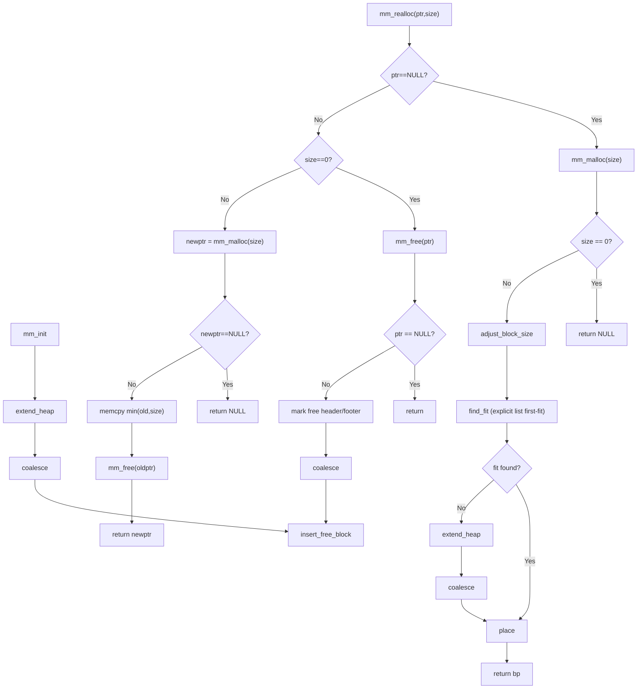

```mermaid
flowchart TD
    A["mm_init"] --> B["extend_heap"]
    B --> C["coalesce"]
    C --> D["insert_free_block"]

    E["mm_malloc(size)"] --> F{"size == 0?"}
    F -- Yes --> G["return NULL"]
    F -- No --> H["adjust_block_size"]
    H --> I["find_fit (explicit list first-fit)"]
    I --> J{"fit found?"}
    J -- Yes --> K["place"]
    J -- No --> L["extend_heap"]
    L --> M["coalesce"]
    M --> K
    K --> N["return bp"]

    O["mm_free(ptr)"] --> P{"ptr == NULL?"}
    P -- Yes --> Q["return"]
    P -- No --> R["mark free header/footer"]
    R --> S["coalesce"]
    S --> D

    T["mm_realloc(ptr,size)"] --> U{"ptr==NULL?"}
    U -- Yes --> E
    U -- No --> V{"size==0?"}
    V -- Yes --> O
    V -- No --> W["newptr = mm_malloc(size)"]
    W --> X{"newptr==NULL?"}
    X -- Yes --> Y["return NULL"]
    X -- No --> Z["memcpy min(old,size)"]
    Z --> AA["mm_free(oldptr)"]
    AA --> AB["return newptr"]

```